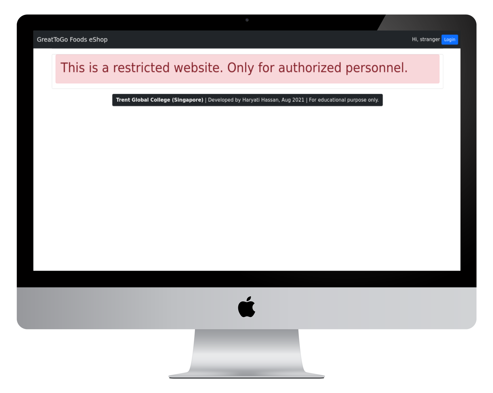
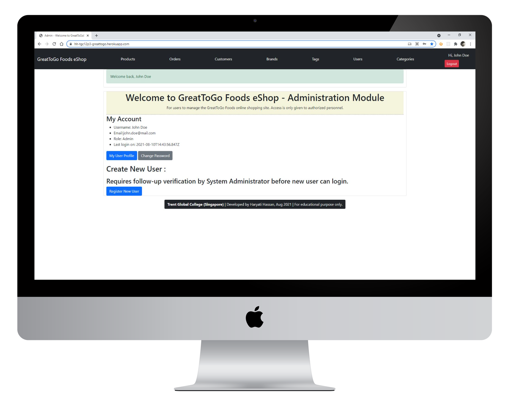
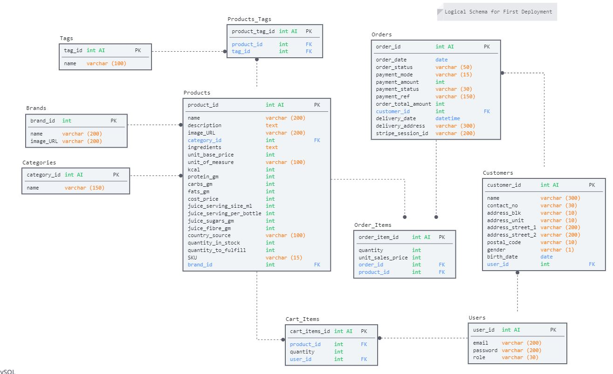
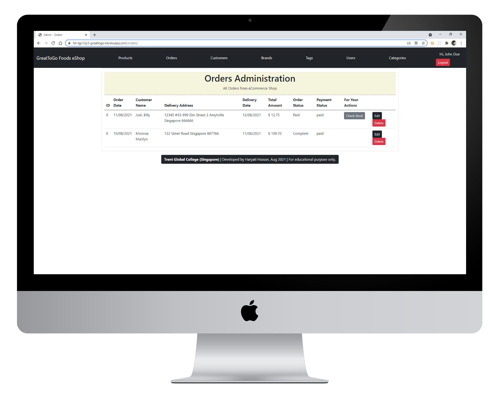

# GreatToGo Foods eShop - Backend
This is the backend administration module for the GreatToGo Foods eShop. An education-purpose project for TGC Singapore.

Backend Website: https://hh-tgc12p3-greattogo.herokuapp.com/

Frontend Website: https://greattogo-foods.netlify.app/

Frontend documentation can be found at Github repo: https://github.com/haryati75/tgc12-p3-gtgfoods

Following screens will appear before and after login:





## Business Goal:  
A meal-delivery eCommerce shop targeting health-conscious foodies in Singapore to buy ready-to-eat meals, snacks and beverages. 

### Target users for the Backend Module: 
1. Business users (or Business owner's authorized personnel)
2. System administrators

## Objectives:
To enable users to perform operations support function:
1. Administer products (including stocks and fulfilment) and associated tables: tags, categories, brands
2. Process orders from customer
3. Administer users and customer information, including access controls and verifications

## Backend Technologies:
* NodeJS Framework
* Express
* REST API, webhooks

## Third-parties API Webhooks:
* Stripe - payment services
* EmailJS - email services
* Cloudinary - image uploading services

## Authentication, tokens & Sessions
* JSON Web Token
* CORS
* CSRF
* Crypto
* Session-file-store
* Express-sessions

## Backend UI
* HBS templates
* Caolan Forms
* Bootstrap
* Flash messages 

## Development environment:
* Gitpod Workspace (use of _Code Institute_ template for students)
* Github repository

## Databases: 
Use of Object-relational Mapping Library (ORM) - **db-migrate, Bookshelf and Knex** to access:
1. MySQL for Development in Gitpod 
2. Postgres for Deployment at Heroku

The final Logical Schema for the database is shown below:


### db-migrate files:
1. Each table has its own file
2. Foreign keys are added as separate files
3. Subsequent addition of each field are in separate files

## Entity Models:
1. Products
2. Orders (One-to-Many with Order Details), (One-to-One with Customer)
3. Order Details 
4. Cart Items (One-to-One with Product, One-to-One with User)
5. Customers (One-to-One with User)
6. Users
7. Blacklisted Tokens

### Foreign Key Tables for Products:
1. Tags (Many-to-Many) 
2. Brands (One-to-One) 
3. Categories (One-to-One) - Admin access only

_Note: CRUD operations is also available for all Foreign Key tables._ 

## Data Access Layers 
Key Data Access Layers were created for the following Models:
1. products
2. customers
3. users
4. cart_items
5. orders

## Services Layers
The above DALs provided the common access of the Models to the following Services with provides functions used by both backend routes and APIs to front-end:
1. **UserServices**
    * Provides user administration, authentication and session controls
2. **CartServices**
    * Provides cart-related functions and payment services integration from the front-end to Stripe payment API
3. **OrderServices**
    * Provide order fulfilment functions in updating of order statuses and product's stock and fulfilment quantities

## Routes and REST API
Backend Routes are used to manage navigation for internal pages which uses HBS.

REST API to frontend are maintained in the _\routes\api_ folder. Key APIs are found in subfolders:
1. checkout.js
2. products.js
3. shoppingCart.js
4. users.js

## Dependencies: 
    "bookshelf": "^1.2.0",
    "bootstrap": "^5.0.2",
    "cloudinary": "^1.26.2",
    "connect-flash": "^0.1.1",
    "cors": "^2.8.5",
    "crypto": "^1.0.1",
    "csurf": "^1.11.0",
    "db-migrate": "^0.11.12",
    "db-migrate-mysql": "^2.1.2",
    "db-migrate-pg": "^1.2.2",
    "dotenv": "^10.0.0",
    "express": "^4.17.1",
    "express-session": "^1.17.2",
    "forms": "^1.3.2",
    "hbs": "^4.1.2",
    "jsonwebtoken": "^8.5.1",
    "knex": "^0.95.8",
    "pg": "^8.7.1",
    "session-file-store": "^1.5.0",
    "stripe": "^8.167.0",
    "wax-on": "^1.2.2"

## Testing of Backend:
Users email logins with password for testing:
* Administrator: john.doe@mail.com / rotiprata
* Business: ali.mat@mail.com / metallica
* Customer: billie.joel@mail.com / rotiprata

Below are test cases for critical path:

### **_Scenario 1_**: Receive Paid Customer's Orders - From Processing to Complete
##### Test Steps:
Login as Business User (john.doe@mail.com/rotiprata)
1. Click Orders from Menu
2. Find Order with Status = 'Paid'
3. Click button _'Check Stock'_ (button visible when status = 'Paid')
4. Click button _'Deliver'_ (button visible when status = 'Ready to Deliver')
5. Click button _'Complete'_ (button visible when status = 'Delivering')



##### _Expected Result_: 

_'Check Stock':_ 
  1. If Product's total **"Quantity in Stock + Quantity to Fulfil"** < 0, then Low Stock -> Status change to **'Processing - Low Stock'**, 
   Else change Status to **'Ready to Deliver'**

_'Deliver':_  

  2. if Product's total Stock + Quantity > 0, it will change status to **'Delivering'**, 
   Else it will go back to **'Processing - Low Stock'**

  3. Reduce Quantity to Fulfil for each Order Item's Product

_'Complete':_
4. Change status to **'Complete'** and no other Processing buttons will be visible
 
  
### **_Scenario 2_**: Low Stock update at Product
_When Product's stock quantity is < 0, the Front-end will show "Low Stock Availability" message but still allows Customers to make orders.  
The order quantity will then be updated into **_Quantity to Fulfil_** in Products. Backend users can update the Product's stock quantity, which will remove the low stock message at the front-end._
##### Test Steps:
1. Click Products from Menu, to goto Product Listing
2. Enter Quantity (+/-) into selected Product's **Add Stock**
3. Click on **Add** button

##### _Expected Result_: 
1. Selected Product's Stock Available will be increased or decreased based on Quantity updated

### **_Scenario 3_**: Business users cannot access System Administration module 
1. Login as Business User (ali.mat@mail.com/metallica)
2. Go to Users or Categories in the Menu
##### _Expected Result_: 
1. Red boxed message appears below Menu: "You are not authorized to access that page..."

### **_Scenario 4_**: Customer-Users cannot access the Backend module 
1. Login as Customer User (billie.joel@mail.com/rotiprata)

##### _Expected Result_: 
1. Red boxed message appears below Menu: "Sorry you have provided the wrong credentials"
  
## Deployment: 
Change port 3000 to process.env.PORT in app.listen():
```
app.listen(process.env.PORT, () => {
    console.log("Server has started");
});
```
Deployed at Heroku (free plan) with added database Postgres.
Push deployment changes to Heroku
```
git add .
git commit -m "Deploy to Heroku"
git push heroku master
```

Copy Global variables:
```
BASE_URL=<deployed Heroku URL>
APP_URL=<deployed Netlify URL>
DB_DRIVER=<postgres>
DB_USER=<postgres db user id>
DB_PASSWORD=<postgres db password>
DB_DATABASE=<postgres db name>
DB_HOST=<postgres host>
SESSION_SECRET_KEY=<key for backend session>
CLOUDINARY_NAME=<your cloudinary name>
CLOUDINARY_API_KEY=<your cloudinary API key>
CLOUDINARY_API_SECRET=<your cloudinary API secret>
CLOUDINARY_UPLOAD_PRESET=<upload preset from cloudinary>
STRIPE_KEY_PUBLISHABLE=<your stripe publishable key>
STRIPE_KEY_SECRET=<your stripe secret key>
STRIPE_SUCCESS_URL=/checkout/success
STRIPE_ERROR_URL=/checkout/cancelled
STRIPE_ENDPOINT_SECRET=<your stripe webhook endpoint key>
TOKEN_SECRET=<key for api access token>
REFRESH_TOKEN_SECRET=<key for api refresh token>
EMAILJS_USERID=<emailjs user id>
```
### Tokens and Keys:
1. Create new Endpoints at Stripe Developers Webhooks for event: _checkout.session.completed_
2. Retrieve new STRIPE_ENDPOINT_SECRET key
3. Go to Random Key generator (https://randomkeygen.com/) to generate tokens for:
 * SESSION_SECRET_KEY
 * TOKEN_SECRET
 * REFRESH_TOKEN_SECRET


## Credits:
Trent Global College, Singapore

Developed by: Haryati Hassan, TGC Batch 12
August 2021